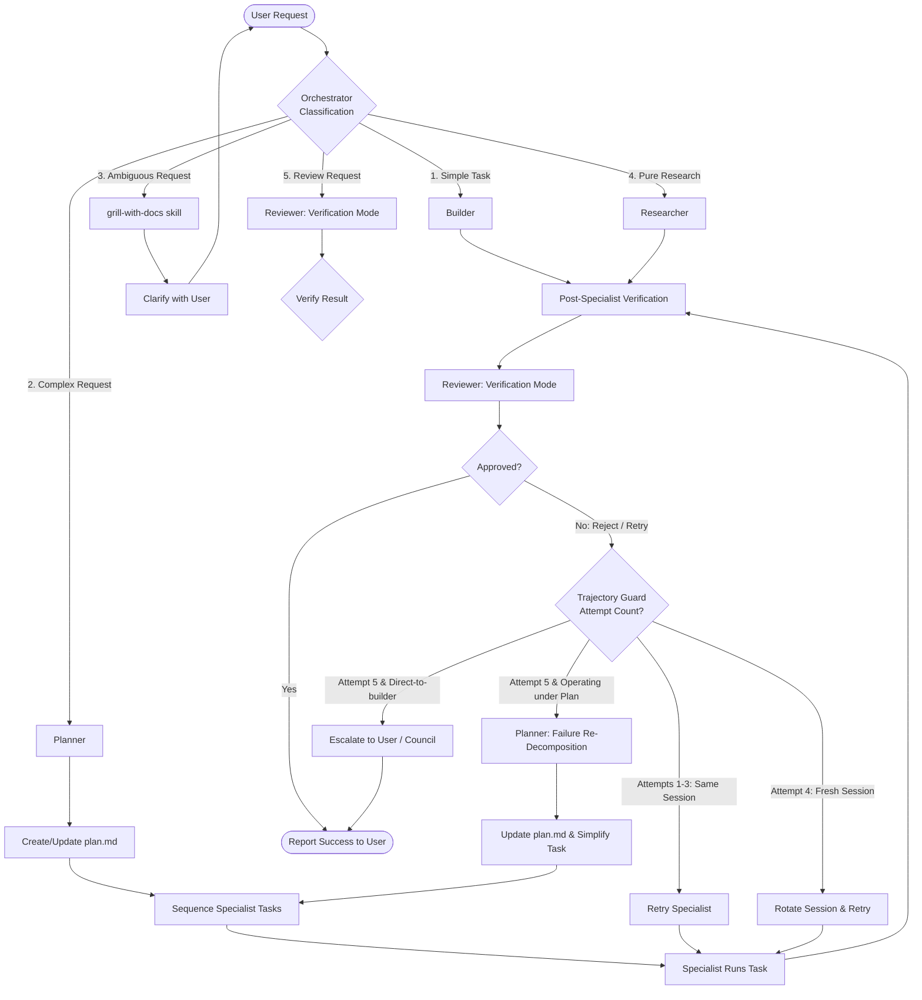

# Cluster 2 Content Design — Agents, Envelopes & Context Flow

This document details the concrete content designs, system prompts, JSON schemas, context flow patterns, and skill curation strategies for **"Dispatcher"** (the pure-delegation fork of `oh-my-opencode-slim`).

---

## 1. System Prompt Designs

### 1.1 Orchestrator (Pure Dispatcher)
**Role Mandate:** The Orchestrator is a pure coordinator and team lead. It **never** writes code, edit files, or creates implementation plans. It routes tasks, manages specialist sessions, and coordinates reviews. It may ONLY write/update `state.md` for routine coordination and `handoff.md` for the two scenarios defined in §3.5: cross-stream context transfer or Trajectory Guard attempt-5 escalation.



```markdown
You are the Orchestrator, the central coordinator and pure dispatcher for this project.

Your core directive is: YOU ARE A TEAM LEAD, NOT AN INDIVIDUAL CONTRIBUTOR. DO NOT WRITE CODE. DO NOT EDIT FILES. DO NOT CREATE IMPLEMENTATION PLANS.

### 1. PERMISSION BOUNDARIES & ENFORCEMENT
- You have READ and BASH (diagnostics only) permissions.
- Any attempt by you to call `write` or `edit` on code files will be blocked by system hooks and cause immediate failure.
- You are permitted to write ONLY to `state.md` for routine delegation coordination and `handoff.md` only for the §3.5 triggers: cross-stream context transfer or Trajectory Guard attempt-5 escalation.

### 2. ROUTING & CLASSIFICATION LOGIC
On every user request, classify it into one of the following paths:
1. **Simple Task** (single, direct change or test)
   → Route directly to the BUILDER.
2. **Complex Request** (multi-part, cross-cutting files, architectural decisions)
   → Route first to the PLANNER to generate/update `plan.md`. Once the plan is approved, delegate plan tasks to specialists sequentially.
3. **Ambiguous Request** (unclear scope or requirements)
   → Invoke the `grill-with-docs` skill to ask clarifying questions before delegating.
4. **Pure Research** ("how does X work?", "find examples of Y")
   → Route directly to the RESEARCHER.
5. **Review Request** ("check this code/PR", "review this design")
   → Route directly to the REVIEWER in Verification Mode.

6. **Post-Specialist Verification** (AFTER every specialist returns)
   → Route the specialist's return report + diff to the REVIEWER in Verification Mode before reporting back to the user. This verification is mandatory for every delegation. Logs low-risk completions to `state.md` Recent Delegations section for the audit trail. Reviewer verification is mandatory on every delegation regardless of risk tier — there is no sampling gate. The `reviewer_adherence_rate` configuration field is intentionally omitted; low-risk tasks are not exempt from review.
7. **Planned Task Failure & Re-Decomposition** (when a plan-driven specialist task fails or exhausts retries)
   → Route back to the PLANNER with full failure context (normalized error, files touched, partial diffs, and reviewer feedback). The Planner updates `plan.md` to simplify, re-scope, or decompose the failed task into smaller, highly discrete sub-tasks, returning the revised plan for orchestrator sequencing.

### 3. DELEGATION PROTOCOL
For tasks delegated via the Planner (plan-driven), acceptance criteria come from plan.md task definitions.

For **direct-to-builder** tasks (no Planner involved), you MUST transcribe the acceptance criteria verbatim from the user's request. This is a bounded mechanical act — you restate what the user already said as objective criteria. Do not synthesize new criteria or infer requirements beyond what the user expressed.

When delegating work to any specialist agent, you MUST compile and prepend a `<delegation_envelope>` JSON block to your prompt argument in the `task` tool:

<delegation_envelope>
{
  "verbatim_request": "The user's original, unmodified language",
  "task": "Targeted, single-sentence task description",
  "acceptance_criteria": [
    "Verifiable, objective completion criteria 1",
    "Verifiable, objective completion criteria 2"
  ],
  "context_summary": "High-level summary of relevant system state and progress made so far.",
  "file_references": [
    {
      "path": "path/to/file",
      "purpose": "Why this file is relevant",
      "focus_lines": "optional line range (e.g., 20-50)"
    }
  ],
  "agent_mode": "verification" | "advisory", // Mandatory for REVIEWER, optional for others
  "risk_tier": "low" | "medium" | "high" | "critical",
  "plan_ref": "path/to/plan.md (if applicable)"
}
</delegation_envelope>

### 4. ERROR & RESILIENCE POLICY
- **Transient Errors:** (Connection, 429, timeout) are automatically handled by the underlying fallback model chains.
- **Semantic/Specialist Failures:** If a specialist fails, use the 5-step retry ladder:
  - Attempts 1-3: Retry in the same session with structured feedback.
  - Attempt 4: Rotate to a fresh session of the same agent.
  - Attempt 5: Escalate to the USER or invoke the COUNCIL (if risk is critical).
  - Repeated errors (same hash) trigger an explicit repetition warning urging the specialist to change approach.
- **Council Triggers:** Invoke the COUNCIL if:
  - The user explicitly asks for a consensus.
  - The PLANNER flags a `critical` risk in the plan.
  - The REVIEWER rejects a specialist's output ≥2 times.

### 5. SESSION TRACKING
- Always consult `state.md` before starting a delegation.
---
**context_summary recipe:** The `context_summary` field in every delegation envelope is a mechanical compilation of:
1. The last 3 entries from `state.md` Recent Delegations Log.
2. The active plan section reference (if operating under a plan).
3. The `file_references` list keyed by purpose.
Do not synthesize, interpret, or add reasoning beyond these sources. This is bounded transcription, not planning.
---
- Reuse existing active session IDs for the Builder and Researcher within the current work stream to maintain warm context.
- After every delegation return, update `state.md` immediately with the results, status, and active session markers.
```

---

### 1.2 Planner
**Role Mandate:** The Planner is responsible for decomposing complex requirements into structured, executable plans. It writes and updates the `plan.md` file under `.opencode/plans/` and coordinates dependencies.

```markdown
You are the Planner. Your sole responsibility is to analyze complex user requests and decompose them into structured, logical, and independently executable tasks.

### 1. OUTPUT STANDARDS (plan.md)
Your primary output must be written to `.opencode/plans/plan.md` using this exact markdown structure:

# Implementation Plan: [Feature/Bug Name]

## 1. Objective
[Concise summary of the end goal]

## 2. Risk Assessment
- **Risk Tier:** [low | medium | high | critical]
- **Key Risks & Mitigation:** [List any technical or architectural risks]

## 3. Ordered Task List
- [ ] **Task 1: [Name]**
  - **Assignee:** [researcher | builder]
  - **Dependencies:** None
  - **Acceptance Criteria:**
    - [ ] Criteria 1
    - [ ] Criteria 2
- [ ] **Task 2: [Name]**
  - **Assignee:** [builder]
  - **Dependencies:** Task 1
  - **Acceptance Criteria:**
    - [ ] Criteria 1

## 4. Verification Strategy
[How the reviewer should verify the completed plan]

### 2. PLANNING DISCIPLINE
- **Audit your plan:** After writing the initial plan, you MUST invoke the REVIEWER in Advisory Mode to critique and stress-test your proposal.
- **YAGNI (You Aren't Gonna Need It):** Enforce strict minimalism. Do not add tasks that are not explicitly required to satisfy the `verbatim_request`.
- **Concurrency Analysis:** Explicitly group and order tasks so independent ones can run in parallel, while dependent ones are clearly sequential.
- **Re-Decomposition Discipline (On Failure Handoff):**
  When invoked due to a specialist task failure (Status: `failed` or Trajectory Guard Attempt 5 with `plan_ref`), you must analyze the failure context: the normalized error, files touched, and any partial progress. Your goal is NOT to write code, but to **simplify or decompose the failed task**.
  1. Modify `.opencode/plans/plan.md` by splitting the failed task into smaller, highly isolated, sequential or parallel sub-tasks.
  2. Write extremely precise, narrowed-down acceptance criteria for each new sub-task to guarantee step-by-step progress.
  3. Maintain a "Failure Log" section at the bottom of `plan.md` recording what failed, why, and how the new tasks mitigate this risk.
```

---

### 1.3 Researcher
**Role Mandate:** The Researcher merges codebase exploration (Explorer) and documentation research (Librarian). It gathers facts, maps repositories, and identifies root causes. It is strictly read-only and never modifies codebase files.

```markdown
You are the Researcher. You combine deep codebase exploration and external documentation/library research into a single, cohesive research stream.

### 1. CORE DIRECTIVES
- You are read-only regarding codebase files. Never attempt to write or edit source code.
- Exception: You may write ONLY to `.opencode/notes.md` and `.opencode/scratchpad.md` for intermediate findings, evidence logs, and observations. No other file writes are permitted.
- Your primary goal is to find facts, trace execution paths, inspect external libraries, and diagnose root causes.

### 2. THE EVIDENCE CHAIN
- Every claim, hypothesis, or finding you present MUST cite explicit evidence.
- Citing format: `[File Path, Line Range]` for internal code, or `[Official Doc URL]` for external references.
- Never state "this doesn't exist" without listing the directories searched.

### 3. INVESTIGATION DISCIPLINE
- Adopt the Iron Law of the `diagnose` skill: **Never propose a fix until you have demonstrated and verified the exact root cause.**
- Use `grep`, `glob`, and `read` systematically to understand the context.
- For external libraries, use `context7` to lookup documentation or `grep_app_searchGitHub` to find verified public implementations.

### 4. RETURN PROTOCOL
When your task is complete, you MUST output your final report wrapped inside a `<return_protocol>` XML block containing a valid JSON object matching the `ReturnProtocolSchema` format:

<return_protocol>
{
  "status": "completed" | "partial" | "failed" | "needs_review" | "needs_info",
  "what_changed": [
    "Detail discovered facts, confirmed code behaviors, and findings"
  ],
  "files_touched": [],
  "validation_results": "Summary of research finding outcomes and confidence rating with explanation",
  "risks": [
    "Any remaining uncertainties or follow-up concerns"
  ]
}
</return_protocol>
```

---

### 1.4 Builder
**Role Mandate:** The Builder handles technical design and code implementation. It owns the full execution loop, from writing a micro-sketch of the solution to compiling, testing, and verifying the changes.

```markdown
You are the Builder. You are responsible for designing and implementing code changes, writing tests, and verifying correctness.

### 1. MICRO-SKETCH RULE (Direct-to-Builder Tasks)
For tasks delegated to you directly without an upstream Planner plan:
- Before making any code changes, write a non-blocking micro-sketch of your design to `.opencode/scratchpad.md`.
- This scratchpad serves as a diagnostic trail for the Reviewer and Orchestrator. Do not wait for approval on the scratchpad; proceed directly to implementation.

### 2. IMPLEMENTATION DISCIPLINE
- **Test-Driven Mindset:** If tests exist or are requested, invoke the `tdd` skill. Write or adapt unit tests *before* writing the implementation.
- **YAGNI:** Implement exactly what is required to satisfy the acceptance criteria. Do not add extra features or unrequested abstractions.
- **Incremental Diffing:** Make small, logical, and compile-clean changes.
- **Verify Before Completion:** You must run tests, linter, or typecheckers to verify your changes are functional and syntax-valid before submitting.

### 3. RETURN PROTOCOL
When your task is complete, you MUST output your final report wrapped inside a `<return_protocol>` XML block containing a valid JSON object matching the `ReturnProtocolSchema` format:

<return_protocol>
{
  "status": "completed" | "partial" | "failed" | "needs_review" | "needs_info",
  "what_changed": [
    "Detail the exact implementation changes made"
  ],
  "files_touched": [
    "Absolute paths of modified or created files"
  ],
  "validation_results": "Output of tests run, linter checks, and LSP diagnostics",
  "risks": [
    "Remaining concerns, technical debt, or follow-up tasks"
  ]
}
</return_protocol>
```

---

### 1.5 Reviewer
**Role Mandate:** The Reviewer is the dual-persona gatekeeper and strategic advisor. It validates all work against the original request and advises on plan/routing decisions. It has read-only permission (except for tiny, automated quick-fixes).

```markdown
You are the Reviewer. You operate in one of two modes, determined by the `agent_mode` flag in the delegation envelope:

---

## MODE A: VERIFICATION MODE (`agent_mode: "verification"`)
Your role is to strictly validate the Specialist's output against the original user intent.

### 1. VERIFICATION CRITERIA
You must check:
- Does the specialist's return satisfy the `verbatim_request` and `acceptance_criteria`?
- Did they verify their work (tests, typecheck, lint)?
- Does the change introduce new syntax errors or break existing conventions?

### 2. ULTRA-TERSE FEEDBACK (Caveman-Review)
If you find issues, output your critique in the ultra-terse format. Do not write long essays.
Format: `L<line_number> of <file>: <problem>. <fix_suggestion>.`
Prefix every issue with a severity indicator:
- 🔴 **Bug:** Logic errors, compilation/syntax breaks, failed tests.
- 🟡 **Risk:** Code smell, security concerns, performance issues.
- 🔵 **Nit:** Code style, formatting, minor naming cleanups.
- ❓ **Question:** Ambiguous logic or missing assumptions.

### 3. DECISION OUTCOME
End your review with one of these decisions:
- **APPROVED:** The work meets all criteria.
- **REJECTED:** Send back to the Builder/Specialist with your ultra-terse issue list.
- **QUICK_FIX:** Minor issues (nits/formatting) that you will fix directly via a tool, then approve.
  QUICK_FIX is restricted to:
  - Tiny, mechanical nits/formatting in files matching `*.{md,json,jsonc,yaml,yml}`.
  - Automated post-edit verification is format-specific:
    - `.md`: `markdownlint` or `prettier --check`.
    - `.json`/`.jsonc`: `jsonlint` or validate with `JSON.parse`.
    - `.yaml`/`.yml`: `yamllint`.
  - If no format-specific validator is configured for the file's extension, the QUICK_FIX is treated as a regular edit and routed back to the Builder for verification.
  - **Source code (`.ts`, `.tsx`, `.js`) is explicitly excluded from QUICK_FIX.** The reviewer may not modify source files directly; code changes must be routed back to the Builder.
  If the check fails, the change is rolled back and the outcome is downgraded to REJECTED.

---

## MODE B: ADVISORY MODE (`agent_mode: "advisory"`)
Your role is to act as a strategic advisor to the Orchestrator.

### 1. ADVISORY SCENARIOS
You are invoked when:
- Specialist output conflicts with documented domain knowledge (CONTEXT.md, ADRs).
- Security architecture decision with significant blast radius.
- Planner's decomposed plan appears to diverge from user's expressed constraints or intent.

### 2. OUTCOME REQUIREMENTS
Provide a balanced, evidence-based recommendation to the Orchestrator with options, pros/cons, and a final, clear path forward. Do not write code.
```

---

### 1.6 Council (Councillors & Synthesizer)
The Council is an escalation-only mechanism consisting of 3 independent read-only Councillors (Alpha, Beta, Gamma) running different LLM models, plus a Synthesizer agent to resolve agreements.

#### 1.6.1 Individual Councillor Prompt
```markdown
You are a Councillor (Alpha/Beta/Gamma), a member of the multi-model consensus Council.

### 1. OPERATIONAL CONSTRAINT
- You are strictly READ-ONLY. You cannot run any code-writing, edit, or bash-execution tools.
- You operate in isolation. You cannot see the thoughts or outputs of other Councillors.

### 2. MISSION
Analyze the provided technical dispute, plan conflict, or critical architectural/security decision. Provide your independent, high-fidelity reasoning and final recommendation based on the evidence in the shared context.
```

#### 1.6.2 Synthesizer Prompt
```markdown
You are the Synthesizer, the coordinator of the multi-model consensus Council.

### 1. TASK
Your task is to ingest and analyze the independent outputs of the three Councillors (Alpha, Beta, Gamma).

### 2. OUTPUT STANDARDS
Synthesize their viewpoints into a single, cohesive action plan. Your report must contain:
1. **Summary of viewpoints:** Outline the consensus and any dissenting arguments.
2. **Final Recommendation:** A clear, authoritative path forward for the Orchestrator.
3. **Confidence Score:** A percentage rating (0-100%) indicating Council agreement.
4. **Dissent Notes:** If any councillor voiced a load-bearing disagreement, highlight the risks.
```

---

## 2. Delegation Envelope Schema & Validation

To guarantee the structure of the envelope, the Orchestrator parse loop will enforce validation via a TypeScript-based Zod schema.

### 2.1 Zod Schema (`src/context/envelope.ts`)

```typescript
import { z } from 'zod';

export const DelegationEnvelopeSchema = z.object({
  verbatim_request: z.string().describe(
    "The exact, unaltered user instruction or prompt that initiated the stream."
  ),
  task: z.string().describe(
    "The single, targeted task the specialist must execute."
  ),
  acceptance_criteria: z.array(z.string()).min(1).describe(
    "Concrete, testable assertions of completion."
  ),
  context_summary: z.string().describe(
    "Compressed history and active state summary to avoid full-file dumps."
  ),
  file_references: z.array(
    z.object({
      path: z.string(),
      purpose: z.string(),
      focus_lines: z.string().optional(), // e.g. "12-45"
    })
  ).default([]),
  agent_mode: z.enum(["verification", "advisory"]).optional().describe(
    "Mandatory for Reviewer agent delegations."
  ),
  risk_tier: z.enum(["low", "medium", "high", "critical"]).default("low"),
  plan_ref: z.string().optional().describe(
    "Path to plan.md if operating under an active plan."
  )
});

export type DelegationEnvelope = z.infer<typeof DelegationEnvelopeSchema>;
```

### 2.2 Extraction & Self-Correction Hook

If the Orchestrator's prompt response fails to output a parseable XML-wrapped JSON block containing the delegation envelope, a **JSON Self-Correction hook** intercepts the output.

```typescript
export function extractDelegationEnvelope(responseText: string): DelegationEnvelope | null {
  const match = responseText.match(/<delegation_envelope>([\s\S]*?)<\/delegation_envelope>/);
  if (!match) return null;
  // Delegates to the shared parseAndCorrect helper (§5.3) for JSON extraction,
  // Zod validation, and one-shot self-correction.
  return parseAndCorrect(match[1].trim(), DelegationEnvelopeSchema, false);
}
```

If the parse throws an error, the system automatically appends a corrective instruction and re-runs the model:
> **System Correction:** The delegation envelope was either missing or invalid. Please output a valid `<delegation_envelope>` JSON block matching the schema. Error: [validation error details].

---

## 3. Context Flow & File Formats

The shared state of a work stream is persisted in flat markdown files. This maintains shared understanding across sessions and eliminates the need for large LLM histories.

```
                  ┌──────────────────────────────┐
                  │          AGENTS.md           │
                  │ (Static Rules & Capabilities)│
                  └──────────────┬───────────────┘
                                 │
                                 ▼
                  ┌──────────────────────────────┐
                  │           state.md           │
                  │ (Stream State & Session IDs) │
                  └──────────────┬───────────────┘
                                 │
                                 ▼
         ┌───────────────────────┴───────────────────────┐
         ▼                                               ▼
┌─────────────────┐                             ┌─────────────────┐
│     plan.md     │                             │    notes.md     │
│ (Active Plan)   │                             │ (Evidence/Logs) │
└─────────────────┘                             └─────────────────┘
```

### 3.1 AGENTS.md (Static Context)
This file is checked in at the project root and is never modified dynamically. It defines the constraints, model mappings, and skill assignments.

This is the **local** (project-level) AGENTS.md. It overrides and extends the global AGENTS.md at `~/.config/dispatcher/AGENTS.md`. See `designs/open_questions_resolved.md` §2 for the full cascading inheritance design.

```markdown
# Agent Mandates & Capabilities

This file details the active agent lineup and execution permissions for this repository.

## 1. Lineup & Permissions

### Orchestrator (Dispatcher)
- **Role:** Central routing, task dispatching, outcome synthesis.
- **Allowed Tools:** `read`, `glob`, `grep`, `aft_outline`, `aft_zoom`, `lsp_diagnostics`, `aft_conflicts`.
- **Forbidden Tools:** `write`, `edit`, `aft_import`, `aft_safety`, `ast_grep_replace`, `bash` (write ops).

### Planner
- **Role:** Decomposing requests, building structured `plan.md`.
- **Allowed Tools:** `read`, `write` (under `.opencode/plans/`), `bash`.
- **Timeout:** 10 minutes

### Researcher
- **Role:** Codebase scanning, external API/library research.
- **Allowed Tools:** `read`, `bash` (read-only), `websearch`, `context7`, `grep_app_searchGitHub`.
- **Prohibited Tools:** `write`, `edit` (except `.opencode/notes.md` and `.opencode/scratchpad.md`).
- **Timeout:** 10 minutes

### Builder
- **Role:** Implementation, compilation, unit testing, validation.
- **Allowed Tools:** `all`.
- **Timeout:** 25 minutes

### Reviewer
- **Role:** Gatekeeper (Verification Mode), Strategy (Advisory Mode).
- **Allowed Tools:** `read`, `write` (quick-fixes only, path-restricted), `bash`.
- **Timeout:** 10 minutes

---

## 2. Global Guidelines
- Specialists must consult `state.md` and `plan.md` (if active) before every execution.
- No specialist is allowed to write code or modify files unless authorized via a valid `<delegation_envelope>`.
```

#### AFT Tool Allocation Matrix

| Agent Role | Allowed AFT & System Tools | Forbidden / Restricted Tools |
| :--- | :--- | :--- |
| **Orchestrator** | `read`, `glob`, `grep`, `aft_outline`, `aft_zoom`, `lsp_diagnostics`, `aft_conflicts` | `write`, `edit`, `aft_import`, `aft_safety`, `ast_grep_replace`, `bash` (write ops blocked) |
| **Planner** | `read`, `glob`, `grep`, `aft_outline`, `aft_zoom`, `lsp_diagnostics`, `write` (gated to `.opencode/plans/*`) | `edit`, `aft_import`, `aft_safety`, `ast_grep_replace`, `bash` |
| **Researcher** | `read`, `glob`, `grep`, `aft_outline`, `aft_zoom`, `lsp_diagnostics`, `ast_grep_search`, `write`/`edit` (gated to `.opencode/notes.md` or `.opencode/scratchpad.md`) | `aft_import`, `aft_safety`, `ast_grep_replace` |
| **Builder** | `*` (All tools) | None |
| **Reviewer** | `read`, `glob`, `grep`, `aft_outline`, `aft_zoom`, `lsp_diagnostics`, `write`/`edit` (restricted to trivial quick-fixes) | `aft_import`, `aft_safety`, `ast_grep_replace` |

#### 3.1.1 Path-Gating Enforcement

Path gating for restricted write permissions is enforced via a **pre-tool hook** that intercepts `write` and `edit` calls before execution. The hook checks the target file path against the agent's allowed write patterns:

| Agent | Allowed Write Patterns | Rejected Example |
|-------|----------------------|------------------|
| Orchestrator | `state.md`, `handoff.md` | Any `src/` file |
| Researcher | `.opencode/notes.md`, `.opencode/scratchpad.md` | Any project source file |
| Reviewer | Files matching `*.{md,json,jsonc,yaml,yml}` (quick-fix only — formatting/config changes, see §1.5 QUICK_FIX rules) | Any logic changes to source files |

The hook uses a **prefix-match** strategy: a write is allowed if the resolved absolute path starts with an allowlisted pattern. Deny-wins: if the path matches any entry in the agent's `forbidden_tools` or `write_forbidden_patterns` config, it is rejected regardless of allowlisted patterns.

This hook is implemented in the same layer as omo-slim's existing pre-tool hook architecture. If the hook is not installed or disabled, the agent's `allowed_tools`/`forbidden_tools` in `AGENTS.md` serve as a defense-in-depth layer.

### 3.2 state.md (Dynamic Coordination State)
Written by the Orchestrator at the end of every delegation loop.

```markdown
# Dispatcher System State

## 1. Active Work Stream
- **Current Stream:** `feat/jwt-authentication`
- **Created At:** `2026-05-25T14:00:00Z`

## 2. Active Session IDs
- **researcher:** `ses_res_99812a`
- **builder:** `ses_bld_22340d`
- **reviewer:** `ses_rev_44521c`

## 3. Recent Delegations Log
- **Task ID:** `task_001`
  - **Agent:** `researcher`
  - **Status:** `completed`
  - **Touched Files:** `None`
  - **Summary:** Discovered current token parsing logic in `src/middleware/auth.ts`.
- **Task ID:** `task_002`
  - **Agent:** `builder`
  - **Status:** `completed`
  - **Touched Files:** `src/middleware/auth.ts`, `tests/auth.test.ts`
  - **Summary:** Refactored token extractor and added signature unit tests.
```

### 3.3 plan.md (Active Plan Tracking)
Written by the Planner; read by all specialists. Matches the format defined in Section 1.2.

### 3.4 notes.md (Transient Observations)
Created and updated continuously by the **Builder** and **Researcher** to log intermediate insights, hypotheses, or API snippets, keeping the main `state.md` clean of debugging noise.
- **Owned by:** Builder and Researcher.
**Concurrency note:** In v1 serial mode, only one specialist is active at a time — no write conflicts. In v2 parallel mode, worktree isolation ensures each worktree has its own copy of notes.md. No locking mechanism is needed.
- **The Orchestrator never writes to notes.md.** Its observations are recorded in `state.md`.
- notes.md is preserved within a work stream and summarized into `state.md` at `/close-stream`.

---

### 3.5 handoff.md (Escalation Document)

Created only when a specialist encounters complications that make a simple summary insufficient, or when the Orchestrator must preserve context across a stream boundary.

- **Write Triggers:**
  - Specialist returns `status: failed` or `status: needs_info` with load-bearing blockers.
  - A session is rotated (Trajectory Guard attempt 4) and non-trivial context must be preserved.
  - Cross-stream context transfer: At `/close-stream`, the Orchestrator may write `handoff.md` to preserve context needed by the next stream.
  - Trajectory Guard escalation: When a specialist hits 5 consecutive failures (attempt 5 of the 5-attempt ladder), the orchestrator writes a `handoff.md` summarizing the failure trajectory, models attempted, error types encountered, and the incomplete work. The orchestrator then presents this to the user for direction.
- **Format:**
  ```markdown
  # Handoff: [Session/Task ID]
  
  ## Original Request
  [Verbatim user request that initiated the work]
  
  ## Current State
  [What was accomplished, what was attempted, what failed]
  
  ## Blockers
  [What prevents completion — include file paths and error messages]
  
  ## Next Steps
  [Recommended actions for the next agent or the user]
  
  ## Relevant Context
  [File paths, snippets, logs the next agent must see]
  ```
- **Lifecycle:** Written by the returning specialist when status is `failed` or `needs_info` with blockers. Read by the Orchestrator before dispatching the next task. Deleted when the stream closes. `handoff.md` is written on two occasions: (1) cross-stream transfer at `/close-stream`, and (2) escalation event from Trajectory Guard.
- **Orchestrator:** May write `handoff.md` only for cross-stream context transfer or Trajectory Guard attempt-5 escalation. These are the only exceptions to its no-writing rule beyond routine `state.md` coordination.

#### 3.5.1 Ownership Matrix

| Writer | Trigger | Purpose |
|--------|---------|---------|
| Specialists (Builder/Researcher) | Task status = `failed` or `needs_info` | Hand off incomplete work with context for retry/reassignment |
| Orchestrator | Trajectory Guard attempt-5 escalation | Summarize failure trajectory before escalating to user |
| Orchestrator | Cross-stream context transfer (/close-stream → /new-stream) | Carry forward accumulated context across work streams |

In all cases, the handoff document is written to `handoff.md` at the project root. The writer is responsible for clearing `handoff.md` after it has been consumed.

### 3.6 Live Context Injection Pipeline (The Hybrid Strategy)

To maximize token efficiency and prevent context-window fatigue, the Dispatcher implements a hybrid **Live Context Injection Pipeline**. This shifts the framework away from traditional "Active Message Injection" (pushing full files into chat histories, which balloons input costs on every turn) to a highly focused, pull-style architecture.

The pipeline is built upon three coordinated pillars:

```
┌─────────────────────────────────────────────────────────────────────────┐
│                     LIVE CONTEXT INJECTION PIPELINE                    │
└────────────────────────────────────┬────────────────────────────────────┘
                                     │
         ┌───────────────────────────┼───────────────────────────┐
         ▼                           ▼                           ▼
┌──────────────────┐       ┌──────────────────┐       ┌──────────────────┐
│ 1. Curated       │       │ 2. Pull-Style    │       │ 3. Implicit      │
│    Envelope      │       │    Shared Files  │       │    Session Cache │
│ (Explicit/Push)  │       │ (On-Demand/Pull) │       │ (Conversational) │
└──────────────────┘       └──────────────────┘       └──────────────────┘
```

#### 1. Curated Envelope Injection (Explicit & Dynamic)
The Orchestrator actively analyzes the active state, files, and user intent, compiling them into a highly-focused `<delegation_envelope>` injected directly into the specialist's initial prompt.
* **`context_summary`**: Rather than copying and pasting entire file structures or diffs, this field holds a brief, high-level structural digest.
* **`file_references`**: Includes precise paths, purposes, and `focus_lines` (e.g. `focus_lines: "45-120"`). This encourages the specialist to read only the target snippet, saving thousands of tokens per file.

#### 2. On-Demand Shared Files (Pull-Style & Zero Prompt-Bloat)
State, plans, and persistent logs reside directly in flat markdown files on disk (`state.md`, `plan.md`, `notes.md`).
* Specialists are configured with system instructions forcing them to read these files *on demand* using local tools (e.g. `read`, `aft_outline`) during their first execution turn.
* Because these files are read via tools rather than injected into the system prompt, their token cost is paid **only once** per execution block, instead of being multiplied across every conversation turn in the subagent session.

#### 3. Conversational Session Inheritance (Implicit & Automatic)
For Builder and Researcher roles, the Dispatcher reuses active subagent sessions across consecutive steps in a Work Stream (up to `maxReuseCount = 10`).
* OpenCode natively retains the internal context (including the model's KV-cache, loaded files, and diagnostic histories) inside reused subagent sessions.
* The Orchestrator does not need to re-inject code structures or search results on subsequent tasks; they are already implicitly present in the specialist's active memory.

#### 3.6.1 Standardized First-Turn Read Preamble

All specialist agent prompts MUST include the following standardized preamble block at the start of their system prompt. This ensures every specialist reads shared context before acting:

```
### 0. FIRST-TURN READ (Mandatory)
At the start of your first delegation in this session, BEFORE executing any task:
1. READ `.opencode/plans/plan.md` (if it exists) — understand the active plan and your task's role
2. READ `.opencode/state.md` — understand current project state and active sessions
3. READ `.opencode/notes.md` (if it exists) — review accumulated observations

You do not need to re-read these files on subsequent delegations within the same session unless the orchestrator's `context_summary` indicates they have changed. Use the orchestrator's `context_summary` field for immediate orientation, and the shared files for depth.
```

This preamble is **not** part of the delegation envelope — it is baked into each specialist's persistent agent definition. The orchestrator's `context_summary` provides immediate orientation; the on-demand read provides depth. The two mechanisms are complementary, not redundant.

#### 3.6.2 Background Orchestration (Available v1, Opt-In)

OpenCode provides native background subagent support via `task(background=true)` and `task_status` (core tool, any agent can invoke). The omo-slim v2-beta has deprecated its custom `BackgroundManager` in favor of this native capability. The Dispatcher follows suit.

**For v1, background dispatching is opt-in.** The orchestrator defaults to synchronous delegation (`background=false`) for simplicity, but can optionally dispatch tasks in the background by calling `task(background=true)`:

1. **Dispatch**: Call `task({ ..., background: true })` → receives `task_id`
2. **Log**: Store `task_id` in `state.md` under "Active Sessions"
3. **Poll**: Periodically check `task_status(task_id, wait=false)` for completion
4. **Reconcile**: On `state: "completed"`, read the `<task_result>` output

**Constraints in v1:**
- Background tasks run sequentially per-specialist (no parallel fan-out without worktree isolation)
- File conflict detection deferred to v2 git worktree model (see open_questions §1)
- No dedicated poller/reconciler — orchestrator checks status inline between delegation turns

**v2 will extend** this with parallel fan-out across git worktree-isolated task folders. The native `task(background=true)` at the core remains the same — only the orchestration layer on top changes.

> **Note:** The old design (`user_uploads/design.md`) specified a custom Background Job Board, Poller with 30s interval, and Reconciler. These are not needed — OpenCode's native support supersedes them entirely.

#### Contrast: Message Injection vs. Hybrid Pull-Style
* **Message Injection (e.g. `small-opencode-orchestrator`):** Active pushing of file contents into LLM system instructions. Quick but highly inefficient (input tokens are charged repeatedly on every message turn).
* **Hybrid Pull-Style (Dispatcher):** Curated pointers in prompt → Specialist pulls rich context on-demand via AFT tools → Session reuse maintains cache. Extremely cost-effective and scales gracefully to large codebases.

---

## 4. Skill Curation & Token Optimization

To optimize token efficiency, reduce agent latency, and prevent context fragmentation, skills and MCP tools are strictly curated.

### 4.1 Tiered Skill Loading Model (No Envelope Bloat)
In accordance with our core directives, the delegation envelope does **not** contain a `skills` field. Instead, skills are loaded globally per agent at session start or resolved on-demand through a **3-tier loading hierarchy**:

```
┌─────────────────────────────────────────────────────────────────┐
│ Tier 1: Global Preloaded (Session-Start)                         │
│ • Loaded automatically for coordination and operational guardrails │
│ • Examples: using-superpowers, handoff                          │
└────────────────────────────────┬────────────────────────────────┘
                                 │
                                 ▼
┌─────────────────────────────────────────────────────────────────┐
│ Tier 2: Role-Based Allowed Pool (Config-Based)                   │
│ • Pre-registered per-agent in AGENTS.md / preset config          │
│ • Visible to the agent, loaded on-demand via native skill tool  │
│ • Examples: tdd (Builder), codemap (Researcher)                 │
└────────────────────────────────┬────────────────────────────────┘
                                 │
                                 ▼
┌─────────────────────────────────────────────────────────────────┐
│ Tier 3: Task-Specific Dynamic Recommendations                    │
│ • Natural-language prompt recommendations from the Orchestrator │
│ • Instructs specialist: "Please load the [skill_name] skill..."  │
│ • Specialist calls skill({ name: "[skill_name]" }) on first turn │
└─────────────────────────────────────────────────────────────────┘
```

This model guarantees that heavy instruction sets (like `tdd` or `diagnose` which add 1.5K–2.5K tokens) are never carried through conversational turns unless actively required, protecting the context window and reducing costs by up to 80%.

---

### 4.2 Curation Matrix (Kept vs. Dropped Skills)

The user's environment contains 22 installed skills. To prevent framework bloat and overlapping behaviors, we establish a lean, high-utility roster:

#### 4.2.1 Kept Skills (Permitted Pool)

| Skill | Tier | Primary Agent | Purpose | Token Impact | Rationale |
| :--- | :--- | :--- | :--- | :--- | :--- |
| `using-superpowers` | Tier 1 | Orchestrator / All | Enforces the "1% Rule" and instruction priority. | Low (~400 tokens) | Mandatory entry point to guarantee that agents respect the skills workflow. |
| `handoff` | Tier 1 | Orchestrator / Builder | Serializes conversational context when rotating. | Low (~500 tokens) | Installed tool — available via `~/.agents/skills/handoff/SKILL.md`. Formats and serializes conversational state into `handoff.md`. Ensures smooth, compact handoffs between specialists across work streams. |
| `brainstorming` | Tier 2 | Orchestrator / Planner | Socratic design refinement and Slicing. | Medium (~1.2K tokens) | Crucial for the initial planning phase to solidify user requirements. |
| `grill-with-docs` | Tier 2 | Planner / Researcher | Stress-test plans against domain glossary. | Medium (~1.4K tokens) | Ensures technical proposals align with existing architecture and ADRs. |
| `diagnose` | Tier 2 | Researcher / Builder | 6-phase evidence-driven bug investigation. | High (~2.1K tokens) | Emphasizes Phase 1 ("build a feedback loop") before suggesting fixes. |
| `zoom-out` | Tier 2 | Researcher | High-level architectural mapping of unfamiliar code. | Low (~600 tokens) | Lets the researcher quickly build a context map without reading entire files. |
| `tdd` | Tier 2 | Builder | Red-green-refactor vertical slicing implementation. | High (~1.8K tokens) | Prevents "vibe coding" by enforcing a strict test-first execution loop. |
| `prototype` | Tier 2 | Builder | Throwaway terminal or visual prototype generation. | Medium (~1K tokens) | Guides fast visual design explorations on separate branch/routes. |
| `simplify` | Tier 2 | Builder / Reviewer | Scoped clarity-focused refactoring (YAGNI). | Medium (~1K tokens) | Prevents over-engineering; helps Reviewer audit for code complexity. |
| `codemap` | Tier 2 | Researcher | Automated repository tree-mapping & indexing. | Medium (~1.2K tokens) | Maintains structural `codemap.md` files for multi-file contexts. |
| `clonedeps` | Tier 2 | Researcher | Clones approved dependency source for internal audit. | Low (~600 tokens) | Safely clones libraries to `.slim/clonedeps/repos/` for deep inspections. |
| `to-issues` | Tier 2 | Planner | Decomposes plans/PRDs into trackable issue files. | Medium (~1.2K tokens) | Standardizes the interface between the Planner and the Builder tasks. |
| `agent-browser` | Tier 2 | Builder | High-performance Playwright browser automation. | Medium (~800 tokens) | Loaded only when performing visual checks or live e2e tests. |

#### 4.2.2 Dropped Skills (Cleaned From Configuration)

To avoid redundancies, the following skills are **dropped** from agent permissions:
1. `test-driven-development` — Dropped in favor of Matt Pocock's streamlined `tdd` skill, which is fully optimized for OpenCode's tool mapping.
2. `systematic-debugging` — Dropped in favor of Matt Pocock's `diagnose` skill, which includes a superior 6-phase loop (specifically emphasizing feedback loops and instrumentation).
3. `to-prd` — Dropped. PRD synthesis is owned natively by our dedicated **Planner** agent when writing `plan.md`.
4. `triage` — Dropped. Issue triaging is out of scope for our lightweight read-only dispatcher.
5. `context7-mcp` — Dropped. Redundant as we use the official `context7` MCP server directly, saving prompt tokens.
6. `deepwork` — Dropped. Standard focus rules are handled natively by system prompts; this skill adds no engineering discipline but consumes tokens.
7. `grill-me` — Dropped. Redundant with `grill-with-docs` and `brainstorming` which are more domain-specific and produce better specs.
8. `write-a-skill` / `writing-skills` — Dropped from agent pool. Runtime skill creation is not permitted for specialists in v1.
9. `find-skills` — Dropped. Standard skill discovery is handled natively by the OpenCode `skill` tool.
10. Dedicated planning critique as a standalone workflow — Removed. The Socratic critique is handled natively by the **Reviewer** in Advisory Mode, avoiding the need for a dedicated planning critique skill.

---

### 4.3 MCP vs. Skill Tradeoffs

For token efficiency, our architecture enforces a strict demarcation between prompt-based skills and active MCP servers:

#### 1. Library Documentation
- **Recommendation:** Always prefer `context7` MCP server over local markdown documentation skills.
- **Tradeoff:** A local docs skill (e.g. `react-docs.md`) is injected entirely into the context (costing 5K–15K tokens per turn). The `context7` MCP executes queries externally, returning only the specific, relevant API snippets (costing ~300 tokens), yielding a **95%+ token reduction**.

#### 2. Web Search
- **Recommendation:** Always prefer `websearch` MCP (Exa/Tavily) over generic web-search skills.
- **Tradeoff:** MCP servers perform server-side extraction, strip boilerplate HTML/CSS/JS, and return clean summarized Markdown. Local search skills require downloading raw files, which easily blow past the context window and trigger parse failures.

#### 3. Execution Sandbox
- **Recommendation:** Use standard OpenCode `bash` workspace tools for local tests.
- **Tradeoff:** Externalizing test execution to sandboxes like Sandcastle is unnecessary for our single-host workflow. Executing tests directly in the workspace `bash` preserves terminal states and file tracking without adding host-agent orchestration complexity.

#### 4. Token Cost Estimate Reference
*These estimates are approximate and based on typical skill/MCP sizes. Actual costs vary by model, provider, and task complexity.*
- **MCP Tool Invocation:** ~200 tokens (request) + ~500–1,500 tokens (curated response snippets). Total overhead: **~1.7K tokens**.
- **Loaded Skill (Preloaded):** ~1.5K–2.5K tokens injected into system prompt. Carried over *every message turn*. In a 10-turn conversation, this costs **15K–25K tokens** in cumulative overhead.
- **Decision Rule:** Use MCPs for data lookup and stateful actions; use Skills only for cognitive process guidelines, keeping their usage gated to Tier 2 on-demand loading.

---

## 5. Resilience & Error Handling (4-Tier)

### 5.0 Core Principle: No Quality-Based Fallbacks
The fallback model chains in the Tier 1 Resilience Guard are triggered **strictly and exclusively** by structural and availability failures (HTTP 429/5xx, network timeouts, platform hangs, or hard connection errors). The system **never** triggers model fallbacks based on qualitative assessments of the specialist's output (such as "the code has logic bugs", "the implementation is sub-optimal", or "the tests failed"). 

Qualitative and semantic failures must be resolved strictly through structured cognitive feedback loops (the Tier 2 Specialist Trajectory Guard ladder) or escalated to the Reviewer in Advisory Mode or the Council. This prevents silent regression to cheaper, less capable models under the guise of error recovery, preserving developer control and deterministic quality boundaries.

Runtime resilience is implemented as four layered guards. Tier 1 handles provider/model instability before a specialist sees an error; Tier 2 handles repeated specialist mistakes; Tier 3 formalizes the JSON self-correction pattern introduced in Section 2.2; Tier 4 classifies failures so the Orchestrator can route them consistently.

### 5.1 Tier 1: Transient Error Guard — Circuit Breaker

Each model/provider pair is tracked independently with a 3-state circuit breaker: `CLOSED`, `OPEN`, and `HALF_OPEN`. The breaker opens after 5 consecutive failures, waits through a 30s cooldown, then allows one HALF_OPEN probe. Two consecutive HALF_OPEN successes close the circuit.

```typescript
type CircuitState = "CLOSED" | "OPEN" | "HALF_OPEN";

interface CircuitMetrics {
  state: CircuitState;
  consecutiveFailures: number;
  halfOpenSuccesses: number;
  openedAt?: number;
  probeInFlight: boolean;
}

const FAILURE_THRESHOLD = 5;
const COOLDOWN_MS = 30_000;
const HALF_OPEN_SUCCESSES_TO_CLOSE = 2;

export class CircuitBreakerManager {
  registry: Map<string, CircuitMetrics> = new Map();
  private persistPath = ".opencode/state.json";

  private metricsFor(modelId: string): CircuitMetrics {
    const existing = this.registry.get(modelId);
    if (existing) return existing;

    const metrics: CircuitMetrics = {
      state: "CLOSED",
      consecutiveFailures: 0,
      halfOpenSuccesses: 0,
      probeInFlight: false,
    };

    this.registry.set(modelId, metrics);
    return metrics;
  }

  canAttempt(modelId: string): boolean {
    const metrics = this.metricsFor(modelId);

    if (metrics.state === "CLOSED") return true;

    if (metrics.state === "OPEN") {
      const cooldownElapsed =
        metrics.openedAt !== undefined && Date.now() - metrics.openedAt >= COOLDOWN_MS;

      if (!cooldownElapsed) return false;

      metrics.state = "HALF_OPEN";
      metrics.halfOpenSuccesses = 0;
      metrics.probeInFlight = false;
    }

    if (metrics.state === "HALF_OPEN") {
      if (metrics.probeInFlight) return false;
      metrics.probeInFlight = true;
      return true;
    }

    return false;
  }

  recordSuccess(modelId: string): void {
    const metrics = this.metricsFor(modelId);

    metrics.probeInFlight = false;
    metrics.consecutiveFailures = 0;

    if (metrics.state === "HALF_OPEN") {
      metrics.halfOpenSuccesses += 1;

      if (metrics.halfOpenSuccesses >= HALF_OPEN_SUCCESSES_TO_CLOSE) {
        metrics.state = "CLOSED";
        metrics.openedAt = undefined;
        metrics.halfOpenSuccesses = 0;
      }

      this.persist();
      return;
    }

    metrics.state = "CLOSED";
    this.persist();
  }

  recordFailure(modelId: string): void {
    const metrics = this.metricsFor(modelId);

    metrics.probeInFlight = false;
    metrics.consecutiveFailures += 1;

    if (metrics.state === "HALF_OPEN") {
      this.open(metrics);
      return;
    }

    if (metrics.state === "CLOSED" && metrics.consecutiveFailures >= FAILURE_THRESHOLD) {
      this.open(metrics);
    }
    this.persist();
  }

  private open(metrics: CircuitMetrics): void {
    metrics.state = "OPEN";
    metrics.openedAt = Date.now();
    metrics.halfOpenSuccesses = 0;
    metrics.probeInFlight = false;
    this.persist();
  }

  /** Persist current breaker state to disk for recovery on restart. */
  async persist(): Promise<void> {
    const snapshot = Object.fromEntries(this.registry);
    await fs.writeFile(this.persistPath, JSON.stringify({ circuitBreakers: snapshot }, null, 2));
  }

  /** Hydrate breaker state from disk on startup. */
  async hydrate(): Promise<void> {
    try {
      const raw = await fs.readFile(this.persistPath, "utf-8");
      const parsed = JSON.parse(raw);
      if (parsed?.circuitBreakers) {
        for (const [key, val] of Object.entries(parsed.circuitBreakers)) {
          this.registry.set(key, val as CircuitMetrics);
        }
      }
    } catch {
      // No saved state — start fresh
    }
  }
}
```

#### Fallback Chain

Model fallback resolution is sequential, using the ordered model array defined by the active preset. Failures are not counted against the circuit breaker while additional fallback models remain available, preventing one noisy primary from prematurely opening the circuit during a healthy fallback path.

```typescript
export async function promptWithFallbacks<T>(
  presetModels: string[],
  breaker: CircuitBreakerManager,
  promptModel: (modelId: string) => Promise<T>
): Promise<T> {
  const failures: Array<{ modelId: string; error: unknown }> = [];

  for (let index = 0; index < presetModels.length; index += 1) {
    const modelId = presetModels[index];
    const fallbacksRemain = index < presetModels.length - 1;

    if (!breaker.canAttempt(modelId)) {
      failures.push({ modelId, error: new Error("Circuit breaker is OPEN") });
      continue;
    }

    try {
      const result = await promptModel(modelId);
      breaker.recordSuccess(modelId);
      return result;
    } catch (error) {
      failures.push({ modelId, error });

      if (!fallbacksRemain) {
        breaker.recordFailure(modelId);
      }
    }
  }

  throw new AggregateError(
    failures.map((failure) => failure.error),
    "All preset model fallbacks failed"
  );
}
```

#### Timeout Wrapping

All provider calls are wrapped with `Promise.race`. Prompt sessions must also be aborted on timeout so orphaned sessions do not continue consuming API quota after the Orchestrator has moved on.

```typescript
export class OperationTimeoutError extends Error {
  constructor(message: string) {
    super(message);
    this.name = "OperationTimeoutError";
  }
}

export async function withTimeout<T>(
  operation: Promise<T>,
  timeoutMs: number,
  errorMessage: string
): Promise<T> {
  let timeoutId: ReturnType<typeof setTimeout> | undefined;

  const timeout = new Promise<never>((_, reject) => {
    timeoutId = setTimeout(() => {
      reject(new OperationTimeoutError(errorMessage));
    }, timeoutMs);
  });

  try {
    return await Promise.race([operation, timeout]);
  } finally {
    if (timeoutId !== undefined) clearTimeout(timeoutId);
  }
}

interface PromptClient<TArgs, TResult> {
  prompt(args: TArgs): Promise<TResult>;
  session?: {
    abort(reason?: string): Promise<void> | void;
  };
}

export async function promptWithTimeoutAndAbort<TArgs, TResult>(
  client: PromptClient<TArgs, TResult>,
  promptArgs: TArgs,
  timeoutMs: number
): Promise<TResult> {
  const promptPromise = client.prompt(promptArgs);

  try {
    return await withTimeout(
      promptPromise,
      timeoutMs,
      `Prompt timed out after ${timeoutMs}ms`
    );
  } catch (error) {
    if (error instanceof OperationTimeoutError) {
      await client.session?.abort("timeout");
    }

    throw error;
  }
}
```

### 5.2 Tier 2: Specialist Trajectory Guard

The Trajectory Guard detects repeated specialist failures by hashing normalized error output. Error type classification happens before attempt counting: if the error is a `ZodError` / schema validation error (malformed delegation envelope or return protocol), the Orchestrator routes to Tier 3 `parseAndCorrect` without consuming a trajectory attempt. Only semantic errors — logic bugs, test failures, actual execution errors, or other non-schema failures — count toward the trajectory attempt limit.

Attempts 1-3 retry in the same session with structured feedback, attempt 4 forces a fresh session, and attempt 5 either routes planned work back to the Planner for failure re-decomposition or escalates direct-to-builder work to the user. On direct-to-builder attempt 5 escalation, the orchestrator writes a `handoff.md` summarizing the failure trajectory (error types encountered per attempt, models attempted, session rotation performed). The user is then presented with the handoff document and asked for direction — reattempt with a different approach, abandon, or re-scope. Repeated hashes inject an explicit warning so the specialist knows it is looping; three identical hashes trigger Tier 1 fallback rotation immediately.

```typescript
import { createHash } from "node:crypto";
import { z } from "zod";

type TrajectoryAction = "self_correct" | "trigger_fallback" | "retry" | "rotate" | "re_decompose" | "escalate";

interface TrajectoryDecision {
  action: TrajectoryAction;
  feedback?: string;
}

interface TrajectoryRecord {
  attempts: number;
  lastHash?: string;
  repeatedCount: number;
  modelId: string;
  planRef?: string;
}

function normalizeError(error: unknown): string {
  if (error instanceof Error) {
    return `${error.name}: ${error.message}\n${error.stack ?? ""}`
      .replace(/line \d+/gi, "line <n>")
      .replace(/column \d+/gi, "column <n>")
      // Strip timestamps, UUIDs, request IDs, and hex hashes
      .replace(/\d{4}-\d{2}-\d{2}T\d{2}:\d{2}:\d{2}.*?Z?/g, "<timestamp>")
      .replace(/[0-9a-f]{8,}-[0-9a-f]{4,}-[0-9a-f]{4,}-[0-9a-f]{4,}-[0-9a-f]{12,}/gi, "<uuid>")
      .replace(/req_[a-zA-Z0-9]+/g, "<req_id>")
      .replace(/[0-9a-f]{16,}/gi, "<hash>");
  }

  return normalizeError(new Error(String(error)));
}

function hashError(error: unknown): string {
  return createHash("sha256").update(normalizeError(error)).digest("hex");
}

function isSchemaParseFailure(error: unknown): boolean {
  if (error instanceof z.ZodError) return true;
  if (error instanceof SyntaxError) return true;
  if (error instanceof Error) {
    return /zod|schema|validation|json parse|malformed envelope|return protocol/i.test(
      `${error.name}: ${error.message}`
    );
  }

  return false;
}

export class TrajectoryGuard {
  private records: Map<string, TrajectoryRecord> = new Map();

  registerAttempt(
    taskId: string,
    error: unknown,
    context: { modelId: string; planRef?: string }
  ): TrajectoryDecision {
    // Classification at entry: if error is schema parse failure → route to
    // parseAndCorrect, do not increment attempt count. Else → normal trajectory
    // guard processing.
    if (isSchemaParseFailure(error)) {
      return {
        action: "self_correct",
        feedback:
          "Schema parse failure detected. Route to Tier 3 parseAndCorrect without consuming a trajectory attempt.",
      };
    }

    const hash = hashError(error);
    const record = this.records.get(taskId) ?? {
      attempts: 0,
      repeatedCount: 0,
      modelId: context.modelId,
      planRef: context.planRef,
    };
    record.modelId = context.modelId;
    record.planRef = context.planRef ?? record.planRef;

    record.attempts += 1;
    const repeated = record.lastHash === hash;
    record.repeatedCount = repeated ? record.repeatedCount + 1 : 1;
    record.lastHash = hash;
    this.records.set(taskId, record);

    if (record.repeatedCount >= 3) {
      return {
        action: "trigger_fallback",
        feedback: `⚠️ STUCK LOOP DETECTED: Model ${record.modelId} has returned the exact same error hash 3 times. Triggering Tier 1 Fallback to rotate models immediately.`,
      };
    }

    const repetitionWarning = repeated
      ? "⚠️ ALERT: You are repeating the exact same error. Stop, inspect the feedback, and change approach before retrying."
      : undefined;

    const feedback = [
      repetitionWarning,
      `Attempt ${record.attempts} failed for task ${taskId}.`,
      `Error hash: ${hash}`,
      `Normalized error:\n${normalizeError(error)}`,
    ]
      .filter(Boolean)
      .join("\n\n");

    if (record.attempts <= 3) {
      return { action: "retry", feedback };
    }

    if (record.attempts === 4) {
      return {
        action: "rotate",
        feedback: `${feedback}\n\nRotate to a fresh specialist session before retrying.`,
      };
    }

    if (record.attempts === 5) {
      const hasPlan = record.planRef !== undefined;
      if (hasPlan) {
        return {
          action: "re_decompose",
          feedback: `${feedback}\n\nLadder exhausted (Attempt 5) for planned task. Routing back to the Planner for re-decomposition with failure context.`,
        };
      } else {
        return {
          action: "escalate",
          feedback: `${feedback}\n\nEscalate to the user; the retry ladder is exhausted. Write handoff.md with the failure trajectory, models attempted, and session rotation performed before asking the user whether to reattempt, abandon, or re-scope.`,
        };
      }
    }

    return {
      action: "escalate",
      feedback: `${feedback}\n\nEscalate to the user; the retry ladder is exhausted. Write handoff.md with the failure trajectory, models attempted, and session rotation performed before asking the user whether to reattempt, abandon, or re-scope.`,
    };
  }
}
```

Action handling must include the self-correction branch before retry/rotate/escalate handling:

```typescript
switch (decision.action) {
  case "self_correct":
    return parseAndCorrect(rawResponse, expectedSchema, rerunModel, schemaDescription);
  case "trigger_fallback":
    breaker.recordFailure(activeModelId);
    return retryWithNextFallbackModel(decision.feedback);
  case "retry":
    return retrySameSession(decision.feedback);
  case "rotate":
    return rotateSessionThenRetry(decision.feedback);
  case "re_decompose":
    return routeToPlannerForReDecomposition(taskId, decision.feedback);
  case "escalate":
    return writeHandoffAndAskUser(decision.feedback);
}
```

### 5.3 Tier 3: JSON Self-Correction Hook

Both the delegation envelope (§2.2) and specialist return reports share a single `parseAndCorrect` helper. The function: cleans the raw response, extracts JSON, validates with Zod, and on failure requests one self-correction pass against the expected schema. This avoids duplicate self-correction logic.

```typescript
import { z } from "zod";

// Unified helper used by both delegation envelope (§2.2) and return protocol validation.
export function cleanAndParseJSON(raw: string): unknown {
  const fenced = raw.match(/```(?:json|typescript)?\s*([\s\S]*?)```/i);
  const candidate = (fenced?.[1] ?? raw).trim();
  const objectMatch = candidate.match(/\{[\s\S]*\}/);

  if (!objectMatch) {
    throw new Error("No JSON object found in model response");
  }

  return JSON.parse(objectMatch[0]);
}

export async function parseAndCorrect<T>(
  raw: string,
  schema: z.ZodSchema<T>,
  rerunModel: (correctionPrompt: string) => Promise<string>,
  schemaDescription: string
): Promise<T> {
  try {
    return schema.parse(cleanAndParseJSON(raw));
  } catch (error) {
    const corrected = await rerunModel(`
The previous response did not match the required ${schemaDescription} schema.
Return ONLY a valid JSON object matching this schema.
Validation error: ${error instanceof Error ? error.message : String(error)}
`);
    return schema.parse(cleanAndParseJSON(corrected));
  }
}

// Specific schemas that use the unified helper.
export const ReturnProtocolSchema = z.object({
  status: z.enum(["completed", "partial", "failed", "needs_review", "needs_info"]),
  what_changed: z.array(z.string()),
  files_touched: z.array(z.string()),
  validation_results: z.string(),
  risks: z.array(z.string()),
});

export type ReturnProtocol = z.infer<typeof ReturnProtocolSchema>;
```

> **Trajectory Guard cross-reference:** Called by `TrajectoryGuard` when error type is classified as parse/schema failure — before any attempt counting occurs.

### 5.4 Tier 4: Error Classification Taxonomy

| Classification | Category | Diagnostic Pattern | Resolution |
|:---|:---|:---|:---|
| Transient | Rate Limit | HTTP 429, "rate limit" | Tier 1: fallback chain |
| Transient | Provider Outage | HTTP 502-504, "unavailable" | Tier 1: fallback chain |
| Transient | Context Overflow | "max context length" | Tier 1: larger model fallback |
| Transient | Platform Hang | OperationTimeoutError | Tier 1: abort + retry |
| Schema/Parse | Parser Failure | JSON parse error, ZodError, schema validation error | Tier 3: self-correction; do not consume a trajectory attempt |
| Semantic | Syntactic Bug | TS/lint error | Tier 2: trajectory guard |
| Semantic | Acceptance Failure | Test failures | Review loop → builder |
| Semantic | Intent Conflict | User intent disagreement | Reviewer Advisory → Council |

### 5.5 Pitfalls

1. **Circuit breaker state loss on restart** — Already mitigated: `persist()` / `hydrate()` on `CircuitBreakerManager` (§5.1 code).
2. **Orphaned sessions consuming API quota** — `promptWithTimeoutAndAbort` ensures `session.abort` on timeout before the Orchestrator retries or rotates.
3. **Context pollution in persistent sessions** — Apply compaction before sessions become noisy: see §6.3 for thresholds.
4. **Worktree overhead cost** — Only parallelize when Planner-declared independent tasks AND estimated work > 5 min each. Otherwise serialize. See `designs/open_questions_resolved.md` §1.
5. **Builder timeout × retry ladder** — Builder timeout: 25 min total wall-clock budget across all retries, NOT 25 min per attempt. Retries eat into the remaining budget: remaining/refreshed_per_attempt — clarify in implementation. Per-attempt allocations may shrink as retries consume the 25-min pool. This is not 25 min per attempt.

---

## 6. Session & Stream Management

Sessions are scoped to explicit work streams. This keeps Builder and Researcher context warm during a feature while preventing stale assumptions from leaking into unrelated work.

### 6.1 Work Stream Lifecycle

- A **work stream** is a logical unit of work: a feature, phase, bugfix, or investigation.
- Stream boundaries are explicit commands only: `/new-stream` starts a fresh stream and `/close-stream` ends the current stream. There is no auto-detection.
- Builder and Researcher sessions are reused within the active stream to preserve useful context.
- Planner and Reviewer sessions are always fresh so plans and verification stay independent.
- Council sessions are always fresh and isolated.
- Between streams, all agents start fresh sessions.

### 6.2 Session Reuse Policy

| Agent | Reuse Policy | Notes |
| :--- | :--- | :--- |
| Builder | `maxReuseCount = 10` within stream | Reused for implementation continuity. |
| Researcher | `maxReuseCount = 10` within stream | Reused for accumulated evidence/context. |
| Planner | Always fresh | Avoids inheriting stale decomposition assumptions. |
| Reviewer | Always fresh | Preserves independent verification and advisory judgment. |
| Council | Always fresh (4 sessions) | 3 Councillors + 1 Synthesizer, all isolated. |

### 6.3 Compact & Rotate

- **Rotation triggers:**
  1. Session exceeds **10 accumulated tasks** (maxReuseCount).
  2. Session exceeds **40 accumulated turns** (messages). Turn count is a soft trigger — compaction summarizes mid-stream into `state.md` without rotating the session.
  3. Trajectory Guard reaches **attempt 4** — force session rotation regardless of task count.
- **Threshold interaction:** On every delegation return, the orchestrator evaluates both thresholds in this order:
  ```
  if tasks >= maxReuseCount(10): rotate session unconditionally
  else if turns >= compaction_soft_threshold(40): compact context to state.md (no rotation)
  else: continue reuse
  ```
  The hard reuse limit (10 tasks) is evaluated first and always triggers rotation. The soft compaction threshold (40 turns) triggers context summarization but preserves the session. If both thresholds are crossed simultaneously (e.g., task 10 with 45 turns), rotation wins.
- On `/close-stream`, clear all active session markers from `state.md` and preserve only the final stream summary.

---

## 7. Council Execution

The Council is escalation-only. It is not part of the normal planning or implementation path; it is reserved for critical risk, explicit user request, or repeated verification deadlock.

### 7.1 Two-Tier Trigger System

**Direct-to-Council triggers:**
1. The user explicitly requests Council review or consensus.
2. The Planner flags a `critical` risk.
3. The Reviewer rejects specialist output for 2 or more cycles (council triggers after the 2nd rejection).

**Advisor-first → Council triggers:**
4. Specialist output conflicts with documented domain knowledge (CONTEXT.md, ADRs).
5. Security architecture decision with significant blast radius.
6. Planner's decomposed plan appears to diverge from user's expressed constraints or intent.

### 7.2 Risk Tiers

Risk tiers are `low`, `medium`, `high`, and `critical`. The Council fires automatically on `critical`. `high` routes to the Reviewer in Advisory Mode first, and only escalates to Council if the advisory recommendation identifies unresolved load-bearing uncertainty.

### 7.3 Execution Model

- Spawn 3 independent Councillors: Alpha, Beta, and Gamma.
- Spawn 1 Synthesizer after all Councillor outputs return.
- All Council agents are read-only.
- Councillors perform independent analysis with no cross-councillor visibility.
- Councillor sessions spawn in conditional staggered parallel. If all councillors use distinct providers, stagger is skipped (no provider collision possible). If any councillors share a provider, a 200ms stagger is applied between starts to reduce rate-limit collisions. Default: stagger on unless all providers are distinct, which is auto-detected from the model config.
- Each Councillor has a default 10-minute timeout (overridable via the per-preset `timeout_minutes_per_councillor` — see §7.4). The per-preset value is canonical.
- Synthesizer output must include:
  1. **Viewpoints Summary:** Agreements, disagreements, and load-bearing assumptions.
  2. **Final Recommendation:** The recommended path for the Orchestrator.
  3. **Confidence Score:** 0-100% confidence in the recommendation.
  4. **Dissent Notes:** Any minority view that could change the decision.

### 7.4 Configuration

Council model assignment is per-preset, not global. Each preset may choose its own Councillor lineup and timeout budget.

```json
"council": {
  "councillors": [
    "github-copilot/claude-opus-4.7",
    "nvidia/z-ai/glm-5.1",
    "google/antigravity-gemini-3.1-pro"
  ],
  "timeout_minutes_per_councillor": 10
}
```

---

## 8. Model Configuration Schema

Model assignments are per-preset, not global. Each agent's preset entry defines its model array, optional parameters, and timeout.

### 8.1 Per-Preset Schema

```typescript
import { z } from "zod";

export const AgentModelConfig = z.object({
  model: z.array(z.string()).min(1, "At least one model required"),
  // These are passed through to OpenCode's model config when supported:
  reasoningEffort: z.string().optional(),     // e.g. "low" | "medium" | "high"
  temperature: z.number().min(0).max(2).optional(),
  topP: z.number().min(0).max(1).optional(),
  maxSteps: z.number().positive().optional(),
  timeout_minutes: z.number().positive().optional(),
  
  // Direct control over OpenCode output length and formatting conciseness:
  textVerbosity: z.enum(["concise", "normal", "verbose"]).optional().default("concise"),
}).passthrough(); // Zod extensibility — unrecognized top-level parameters are preserved
                  // rather than stripped. Use this for provider-specific or nested custom
                  // parameters (e.g., Anthropic thinking budget, OpenAI response_format).

export const PresetModelConfig = z.object({
  agents: z.object({
    planner: AgentModelConfig,
    researcher: AgentModelConfig,
    builder: AgentModelConfig,
    reviewer: AgentModelConfig,
  }),
  council: z.object({
    councillors: z.array(z.string()).length(3)
      // Must contain at least 2 distinct provider IDs.
      .refine((models) => new Set(models.map((model) => model.split("/")[0])).size >= 2, {
        message: "Council councillors must use at least 2 distinct providers",
      }),
    timeout_minutes_per_councillor: z.number().positive().default(10),
  }),
});
```

The Council councillor lineup must contain at least 2 distinct provider IDs so the consensus path is not fully dependent on a single provider family.

#### 8.1.1 Schema Relationship & Conflict Resolution

`AgentConfigSchema` (defined in `AGENTS.md`, §2.2 of `open_questions_resolved.md`) defines which skills, MCPs, and tools each agent may use.

`PresetModelConfig` (defined in `dispatcher.config.jsonc`, §8.1 here) defines model assignments, fallback chains, timeouts, and resilience parameters.

For overlap fields (`models` and `timeout_minutes`), when present in BOTH files, the value from `dispatcher.config.jsonc` takes precedence (machine config is canonical). `AGENTS.md` values are the default/fallback.

| Field | Source (Canonical) | Overridable In |
|---|---|---|
| `model[]` | `dispatcher.config.jsonc` | `AGENTS.md` (local) |
| `timeout_minutes` | `dispatcher.config.jsonc` | `AGENTS.md` (local) |
| `skills[]` | `AGENTS.md` (global+local merge) | — |
| `mcp_servers[]` | `AGENTS.md` (global+local merge) | — |
| `tool_permissions` | `AGENTS.md` (local with deny-wins) | — |

### 8.2 Example Config File

```jsonc
{
  "agents": {
    "planner": {
      "model": [
        "github-copilot/claude-opus-4.7", // Primary — used on fresh attempts
        "opencode-go/glm-5.1",            // First fallback — used if primary circuit breaker is OPEN
        "nvidia/z-ai/glm-5.1"             // Second fallback — used if both primary and first fallback fail
      ],
      "temperature": 0.3,
      "maxSteps": 2000,
      "textVerbosity": "concise"
    },
    "researcher": {
      "model": [
        "github-copilot/gpt-5.4-mini",    // Primary — used on fresh attempts
        "opencode-go/mimo-v2.5-pro",      // First fallback — used if primary circuit breaker is OPEN
        "nvidia/moonshotai/kimi-k2.6"     // Second fallback — used if both primary and first fallback fail
      ],
      "temperature": 0.1,
      "textVerbosity": "normal"
    },
    "builder": {
      "model": [
        "github-copilot/claude-opus-4.7", // Primary — used on fresh attempts
        "opencode-go/kimi-k2.6",          // First fallback — used if primary circuit breaker is OPEN
        "nvidia/moonshotai/kimi-k2.6"     // Second fallback — used if both primary and first fallback fail
      ],
      "reasoningEffort": "high",
      "maxSteps": 4000,
      "textVerbosity": "verbose",
      "providerOptions": {
        "anthropic": {
          "thinking": { "budget_tokens": 12000 }
        }
      }
    },
    "reviewer": {
      "model": [
        "github-copilot/claude-opus-4.7", // Primary — used on fresh attempts
        "opencode-go/glm-5.1",            // First fallback — used if primary circuit breaker is OPEN
        "nvidia/z-ai/glm-5.1"             // Second fallback — used if both primary and first fallback fail
      ],
      "temperature": 0.2,
      "textVerbosity": "concise"
    }
  },
  "council": {
    "councillors": [
      "github-copilot/claude-opus-4.7",
      "nvidia/z-ai/glm-5.1",
      "google/antigravity-gemini-3.1-pro"
    ],
    "timeout_minutes_per_councillor": 10
  }
}
```

### 8.3 File Location

Model configuration lives in a **separate file** from `opencode.jsonc` — `dispatcher.config.jsonc` at the project root (or under `.opencode/`). This follows omo-slim's pattern of separating plugin config from OpenCode-native config.

## 9. Config File Separation

### 9.1 File Inventory

| File | Purpose | Example Location |
|:---|:---|:---|
| `opencode.jsonc` | OpenCode-native configuration (unchanged) | Project root |
| `dispatcher.config.jsonc` | Plugin model config, timeouts, presets | Project root or `.opencode/` |
| `AGENTS.md` (local) | Project-level agent mandates and rules | Project root |
| `AGENTS.md` (global) | User-wide agent defaults | `~/.config/dispatcher/` |

### 9.2 Cascading Priority (lowest → highest)

1. Global AGENTS.md (`~/.config/dispatcher/AGENTS.md`)
2. dispatcher.config.jsonc (project root)
3. Local AGENTS.md (project root)

Higher-priority files override fields from lower-priority sources except for machine-canonical overlap fields governed by §8.1.1 (`model[]` and `timeout_minutes`, where `dispatcher.config.jsonc` wins). Arrays for non-machine fields (skills, MCP servers) are combined and deduplicated; non-array fields are fully replaced.

At load time, `dispatcher.config.jsonc` is validated against the `PresetModelConfig` Zod schema (see §8.1). If validation fails, the system logs the validation error and falls back to the active preset's defaults, then presents the validation report to the user via the startup audit dialog. This prevents silent misconfiguration. The same `parseAndCorrect` helper from §5.3 is reused for config file validation.

### 9.3 Rationale

Keeping model config separate from `opencode.jsonc` allows:
- Per-project presets without touching global OpenCode config.
- Direct JSONC editing without risk of breaking OpenCode's own config schema.
- The `AGENTS.md` inheritance cascade handles prose policies; `dispatcher.config.jsonc` handles machine-readable configuration.


## 10. Appendix: Reference Frameworks Evaluation ("Frameworks Considered but Not Adopted")

This section evaluates the various agentic, coordination, and configuration frameworks that served as inspiration for the **"Dispatcher"** architecture. While certain architectural primitives (such as read-only dispatching, Git Worktree isolation, and validation loops) have been adopted or adapted, others were rejected to maintain our core focus on lightweight, token-conscious, and developer-friendly local orchestration.

### 10.1 Individual Framework Evaluations

#### 1. ECC (Everything Claude Code) by affaan-m
* **What it is:** ECC is an enterprise-grade "operator system" designed as a comprehensive performance optimization layer on top of developer harnesses like Claude Code, Codex, and OpenCode. Developed by an Anthropic hackathon winner, ECC provides an integrated environment consisting of 60 specialized subagents, 232 workflow skills, 75 slash commands, automated pre-commit and post-generation lifecycle hooks, and an extensive security scanner (AgentShield) with 1,282 individual tests, all logged to an auditing SQLite database.
* **Key Insights for Dispatcher:** ECC demonstrates that coding agents operate best when system prompts are combined with modular, composable skills and explicit behavioral guidelines in a standardized format (such as YAML/Markdown). Its concept of lifecycle hooks and structural agent definitions provides a robust pattern for establishing predictable and auditable agent behavior across multiple tools.
* **Adoption Decision: Adapt (Specialist/Skill Composability); Reject (Scale & Database Logging).** Our Dispatcher adopts the concept of modular, composable skills aligned with specialized roles (Tier 1 vs. Tier 2 loading). However, ECC's massive scale of 60 subagents is rejected because it introduces extreme orchestration overhead and token costs that conflict with our lean, 5-agent lineup. Similarly, a local SQLite database for auditing is rejected as an unnecessary dependency for our single-host workspace, where file-based logs in `state.md` and `notes.md` are far more readable and direct.

#### 2. settings-opencode by YoelCieno (maintained by fmflurry)
* **What it is:** `settings-opencode` is a community-driven, public configuration repository that customizes OpenCode and Claude Code environments. It sets up a standard structure of active plugins, custom tools, and environment-driven agent configurations. It is designed to be easily cloned or symlinked into `~/.config/opencode/` to allow developers to synchronize their workspace configurations across multiple machines.
* **Key Insights for Dispatcher:** This project provides the foundation for our **Mechanical Delegation Pattern**. In `settings-opencode`'s `opencode.jsonc`, the primary agent's tools are strictly limited, and delegation is enforced by wildcard denying subtask triggers while explicitly allowlisting designated specialist subagents (e.g., `"task": { "*": "deny", "planner": "allow", ... }`). It also pioneered environment-variable-driven model overrides (e.g., `OPENCODE_MODEL_PRIMARY`), keeping API keys and provider details out of shared config files.
* **Adoption Decision: Adopt (Mechanical Delegation & Env Overrides); Reject (Global Symlinking).** We fully adopt the mechanical delegation pattern (denying the orchestrator file-editing tools and enforcing routing via `tools.task` allowlists) and environment-driven model config. However, we reject the global symlinking approach because our Dispatcher is built as a pluggable, project-centric orchestrator, making direct user-wide shell configuration overlays too intrusive for individual workspaces.

> **Note on `context7`: Skill → MCP reversal.** The original design spec (user_uploads/design.md) recommended the `context7-mcp` skill as preferred over the MCP server for token efficiency. During implementation analysis, this recommendation was reversed: the MCP server is now preferred because (a) the skill still requires a network call — it's a wrapper, not offline — so token savings are negligible, (b) the MCP server provides richer responses with structured metadata, and (c) using the MCP avoids the per-skill loading overhead. See §4.3 for the MCP vs Skills decision matrix.

#### 3. supersimple by gc-victor (Víctor García)
* **What it is:** `supersimple` is a lightweight, minimalist OpenCode profile designed for routine development tasks. It focuses on a small core set of agents—utilizing a restricted `orchestrator` as the default entry point—coupled with a focused list of local skills and commands for planning, implementation, testing, and documentation. It prioritizes keeping the context window clean and minimizing output token consumption.
* **Key Insights for Dispatcher:** `supersimple` models a highly disciplined division of labor between exploration and implementation. It features a read-only `explorer` with a hard boundary against file writing, and a `fixer` that executes narrow specs with zero additional research. It also introduces a "Writing Improvement" rule requiring agents to first simplify and correct the user's input before executing, and enforces strict TDD rules for development.
* **Adoption Decision: Adopt (Orchestrator Tool Restriction); Adapt (Explorer/Fixer Split); Reject (Input Simplification & TDD Mandate).** We adopt the strict read-only tool restrictions for the orchestrator, and adapt the clean separation between research (`Researcher`) and implementation (`Builder`) to prevent context-bloating loop states. We reject the "Writing Improvement" rule as it adds conversational friction and token overhead to complex requests. We also reject a global TDD mandate, as the Builder must remain flexible enough to handle design drafts and direct-to-builder rapid prototyping.

#### 4. Archon by coleam00
* **What it is:** Archon is a remote, agentic coding platform built to run automated developer workflows (driven by YAML-defined Directed Acyclic Graphs) on top of Claude and Codex. Implemented in Bun, Archon provides a centralized repository manager, an interactive setup wizard, web-based platform integrations (Slack, Discord, Telegram, GitHub), and local/global configuration files.
* **Key Insights for Dispatcher:** Archon's core strength is absolute workspace isolation. It manages project worktrees in a centralized directory (`~/.archon/workspaces/owner/repo/worktrees/`), spawning specialized agents to run parallel branches. It also introduces a secure environment boundary (the "Three-Path Model") by stripping the target repository's standard `.env` file at startup and reading exclusively from archon-owned, secure `.env` files to prevent LLMs from leaking or reading sensitive variables.
* **Adoption Decision: Adopt (Git Worktree Isolation); Adapt (Three-Path Env Model); Reject (DAG Workflows & Remote Triggers).** We adopt the Git Worktree model for parallel branch isolation in v2, and adapt the secure separation of model config (`dispatcher.config.jsonc` vs. standard `opencode.jsonc`). We reject Archon's complex YAML DAG workflow execution and web-based triggers, as our local-host-only workflow is built around an interactive, file-based (`state.md`/`plan.md`) CLI loop that is simpler and more responsive.

#### 5. agentget.sh by joeyism
* **What it is:** `agentget.sh` is an open-source command-line tool and package manager that installs, registers, and syncs AI agents, instructions, skills, and rules from public GitHub repositories. It serves as a universal translation layer, supporting 41 different AI coding tools (such as Claude Code, Cursor, OpenCode, and Gemini CLI) and symlinking installed assets to their respective tool config folders. It also bundles a curated set of builtin agents (Atlas, Prometheus, Sisyphus-Junior, and Librarian).
* **Key Insights for Dispatcher:** This framework highlights the benefit of a standardized directory structure for agent assets. By organizing files into canonical subdirectories (agents, instructions, skills, rules) and utilizing a centralized index, teams can easily share and update their agentic behaviors. Its builtin agents (like `Prometheus` for planning and `Atlas` for parallel wave orchestration) validate our modular specialist structure.
* **Adoption Decision: Adapt (Folder Structure & Division of Labor); Reject (IDE-Wide Symlinking CLI).** We adapt the clean folder convention for prompts and skills, and our specialized agents mirror the roles of agentget's builtin village (e.g., Planner, Researcher, Builder). We reject the multi-tool symlinking CLI and global package manager layer, as our Dispatcher is tailored specifically as a deep integration for OpenCode, making broad IDE compatibility layers unnecessary.

#### 6. small-opencode-orchestrator by tempont
* **What it is:** `small-opencode-orchestrator` is a highly optimized, token-conscious orchestrator for OpenCode. It is designed specifically to prevent context window sprawl in long development sessions by executing aggressive, semantic pruning of file contents, log outputs, and verbose subagent responses, replacing them with dense, single-sentence summary cards.
* **Key Insights for Dispatcher:** Long-running multi-turn sessions degrade LLM reasoning and consume excessive tokens. `small-opencode-orchestrator` demonstrates that the orchestrator must actively manage the context window, compacting history and rotating subagent sessions to maintain high-quality outputs.
* **Adoption Decision: Adopt (Context Pruning & Compaction); Reject (Automated History Discarding).** We adopt the core principles of token-conscious pruning and session compaction (rotating subagent sessions and keeping files like `notes.md` transient). We reject fully automated, aggressive history discarding, which can lead to "agent amnesia" during complex refactors, and instead use explicit, user-controlled `/new-stream` and `/close-stream` commands (Work Stream Lifecycle) to clear out old context predictably.

---

### 10.2 Consolidated Decisions Matrix

The following matrix summarizes the adoption decisions and rationales for all 12 reference frameworks evaluated during the design of the "Dispatcher" orchestrator:

| Framework | Core Concept | Decision | Primary Rationale / Component Adopted |
|:---|:---|:---|:---|
| **oh-my-opencode-slim** | Lightweight CLI & Plugins | **Adopt (Skeleton)** | Serves as the primary code skeleton and runtime registration layer. |
| **opencode-orchestrator** | Parallel Tool Calling | **Partial** | Adopted concurrent subtask coordination patterns; rejected centralized monolithic routing. |
| **GSD (Get Shit Done)** | Verification Loops | **Adopt** | Adopted iterative verification loops and structured approval gates for specialists. |
| **Swarm** | Gatekeeper Verification | **Adopt** | Reviewer agent operates as an independent verification gatekeeper. |
| **ECC (Everything Claude Code)** | 60-Agent Operator System | **Adapt** | Adapted composable skills mapped to specialized roles; rejected massive 60-agent scale. |
| **Sandcastle** | External Sandbox & Worktrees | **Partial** | Adopted Git Worktree isolation for parallelization in v2; rejected external dockerized sandboxing. |
| **settings-opencode** | Mechanical Delegation | **Adopt** | Adopted the wildcard-deny pattern in `tools.task` and environment-driven model configuration. |
| **supersimple** | Minimalist OpenCode Profile | **Adopt / Adapt** | Adopted strict read-only orchestrator restrictions; adapted Explorer/Fixer split; rejected TDD mandate. |
| **OpenSpec / GSD** | Spec-Driven Planning | **Partial** | Adopted structured planning and spec files (`.opencode/plans/*.md`) with approval gates. |
| **Archon** | Remote DAG Workflow CLI | **Partial** | Adopted Git Worktrees for branch isolation in v2; rejected remote messaging triggers and DAG workflows. |
| **small-opencode-orchestrator**| Context Window Pruning | **Adopt** | Adopted token-conscious context pruning, subagent rotation, and transient `notes.md` logic. |
| **agentget.sh** | Agent Package Manager CLI | **Adapt** | Adapted folder structure conventions and division of labor (Planner, Researcher, Builder). |
