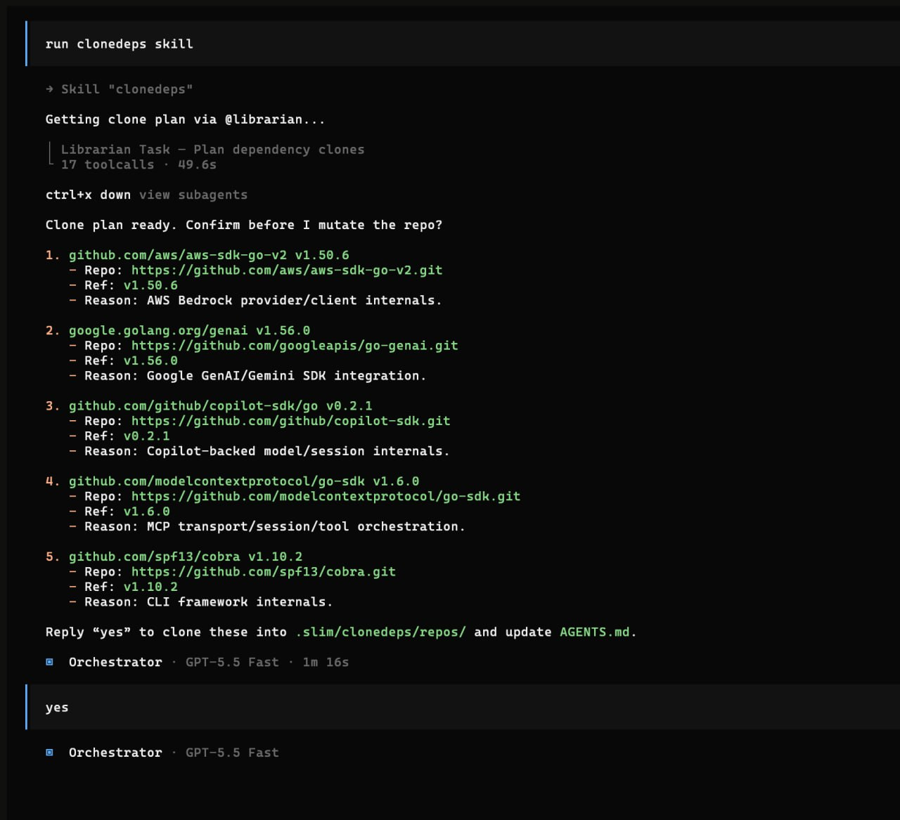

# Clonedeps



`clonedeps` is a bundled Orchestrator skill for cloning a small set of important
dependency source repositories into a local, ignored workspace so agents can
inspect library internals while working on your project.

It is useful when docs are not enough and the agent needs to understand how a
runtime, SDK, framework, plugin API, or other core dependency actually behaves.

---

## What It Does

When you ask for cloned dependency source, the Orchestrator:

1. Checks `.slim/clonedeps.json` first and reuses existing clones when possible.
2. Asks `@librarian` for source-repo recommendations only if more context is
   needed.
3. Presents a small clone plan for approval.
4. Clones each approved source repository once into
   `.slim/clonedeps/repos/<safe-repo-name>/`.
5. Writes `.slim/clonedeps.json` as trackable project metadata.
6. Updates ignore files so git ignores clone contents while OpenCode can read
   them.
7. Updates root `AGENTS.md` with a concise list of cloned repos and why each one
   exists.

There is intentionally no helper script. The workflow uses agent judgment for
source selection and normal git/filesystem operations for cloning.

---

## How To Use It

Ask the Orchestrator directly:

```text
Use clonedeps to clone the key dependency source repos for this project.
```

Or for a specific dependency/debugging task:

```text
Use clonedeps for the OpenCode SDK so you can inspect its plugin API internals.
```

The Orchestrator should show you what it wants to clone before running network
git operations, unless you explicitly ask it to clone immediately.

---

## Files It Creates

### `.slim/clonedeps/repos/`

Ignored local clones live here, one folder per source repository:

```text
.slim/clonedeps/repos/<safe-repo-name>/
```

The safe folder name is derived from the repository owner/name, not the package
name. For example, `https://github.com/opencode-ai/opencode.git` becomes
`.slim/clonedeps/repos/opencode-ai__opencode/`.

If multiple packages come from the same monorepo, they share one cloned repo path
and use different `packagePath` values in the manifest.

These repositories are read-only reference source. Do not edit them.

### `.slim/clonedeps.json`

This is the structured manifest. It is intentionally small and committable:

```json
{
  "version": "1.0.0",
  "updatedAt": "2026-05-12T00:00:00.000Z",
  "dependencies": [
    {
      "name": "@opencode-ai/plugin",
      "resolvedVersion": "1.3.17",
      "repoUrl": "https://github.com/opencode-ai/opencode.git",
      "ref": "v1.3.17",
      "path": ".slim/clonedeps/repos/opencode-ai__opencode",
      "packagePath": "packages/plugin",
      "reason": "Plugin API source used by the project"
    },
    {
      "name": "@opencode-ai/sdk",
      "resolvedVersion": "1.3.17",
      "repoUrl": "https://github.com/opencode-ai/opencode.git",
      "ref": "v1.3.17",
      "path": ".slim/clonedeps/repos/opencode-ai__opencode",
      "packagePath": "packages/sdk/js",
      "reason": "Core SDK source used to inspect runtime behavior"
    }
  ]
}
```

Future clonedeps runs read this file first instead of starting from a fresh scan.

### `AGENTS.md`

The skill also keeps a short `## Cloned Dependency Source` section in the repo
root `AGENTS.md`, listing the cloned repo paths directly so future agents do not
need to read the manifest just to know what exists.

Example:

```markdown
## Cloned Dependency Source

Read-only dependency source repositories are available under
`.slim/clonedeps/repos/` for inspection. Do not edit these clones.

- `.slim/clonedeps/repos/opencode-ai__opencode/` — `opencode-ai/opencode` at
  `v1.3.17`; inspect `packages/sdk/js` for OpenCode SDK internals.
```

---

## Safety Defaults

- Prefer **0-3 strong recommendations** over a dependency dump.
- Clone at most **3-5 core dependencies** by default.
- Use HTTPS repository URLs by default.
- Prefer pinned tags or commit SHAs.
- Do not run install, build, test, or lifecycle scripts from cloned repos.
- Git ignores `.slim/clonedeps/repos/`, but not `.slim/clonedeps.json`.
- Ignore-file edits are limited to managed clonedeps marker blocks.

---

## When To Use It

Use clonedeps when source code is likely to answer questions better than docs:

- debugging SDK or framework behavior;
- implementing against plugin/runtime APIs;
- checking version-specific internals;
- understanding generated types, adapters, or protocol code;
- working with dependencies whose docs are incomplete or stale.

Do not use it for ordinary documentation lookup, tiny utilities, transitive
dependencies, or packages where public docs are sufficient.
